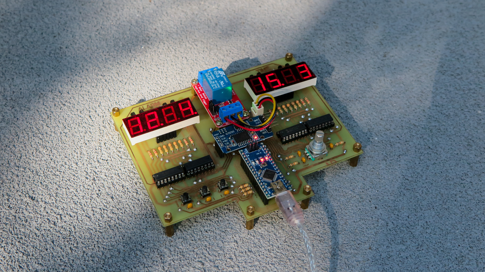
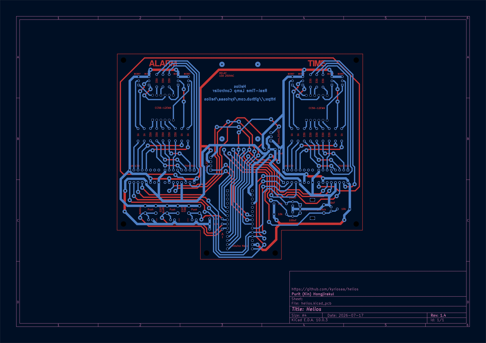
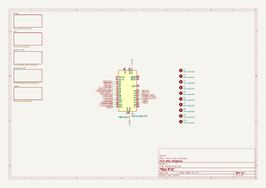
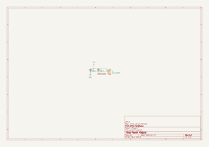
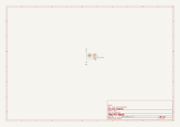
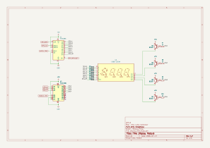
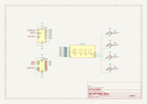
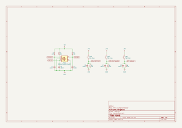
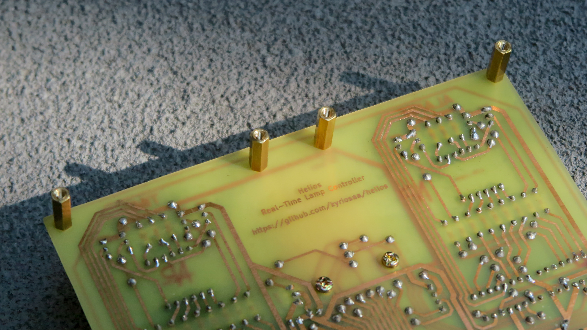

# Helios

A real-time lamp controller for my room. Keeps the time (even when unplugged) and flips a relay once the clock and alarm values match. 

My room doesn't have windows (because I'm a broke college student), so I created this device to automatically turn on my bedside lamp and put myself into fight or flight every morning to help me wake up in time for work/school.

🎥 [Demo Video](https://youtu.be/W-aWS8Oxe-Q?si=ozM3OOpzgYfn5PJq) 🎥

| Sections |
| -------- |
| [Design](#design) |
| [Features](#features) |
| [Hardware](#hardware) |
| [PCB Design](#pcb-design) |
| [Schematic](#schematic) |
| [Images](#images) |

## Design

Some notes on why the board is built the way it is.

### A DS3231 instead of the MCU's own timer
The RTC has its own coin-cell backup, so the clock survives a power outage or being moved to another room. Keeping time on the MCU would mean re-setting the clock every time the device lost power, which is exactly the kind of small annoyance that would make me stop using it.

---

### Discrete multiplexing over a dedicated driver
A MAX7219 or TM1637 would have done this with fewer parts and less code. I used two 74HC595s for the segments and a 74HC138 plus PNP high-side drivers per display because I to practice building the multiplexing myself instead of buying it in a chip.

---

### A polled encoder, not an interrupt 
Every input has a 10k resistor and a 100nF capacitor on it to filter out switch bounce. The tradeoff to this is that signals now fade between HIGH and LOW over about a millisecond instead of snapping. During that fade, the Arduino can't really tell which one it's looking at, so a little noise makes it read HIGH-LOW-HIGH-LOW a few times before settling. An interrupt on `ENC_CLK` (D2) would count every one of those HIGH-LOW flips, so one click of the encoder knob would add 3 or 4 counts. However, reading the pin in the `loop()` function only ever sees the value after it settles, which solves the issue.

---

### Two board versions 
The 2-layer version is meant to be manually etched. But I know most people dont have an etching machine, so the 4-layer version is for anyone who doesn't have an etching setup and would rather send it to a manufacturer (I'm also experimenting with curved traces on the 4-layer version).

## Features

| Feature | Description |
| --- | --- |
| **24/7 Timekeeping** | A coin battery supports the DS3231, so pulling the plug doesn't require a manual time recalibration |
| **Dual Displays** | Separate 7-segment displays for the current time and alarm |
| **Manual Override** | One button forces the lamp on and disarms the alarm. The armed state is shown by a decimal point on the alarm display |
| **System ON/OFF** | Pressing the encoder blanks the displays and cuts the relay |
| **Multiplexed Digits** | Two 74HC595s (daisy-chained) drive segments, 74HC138s + PNP high-side drivers select digits |

## Hardware

| Ref | Qty | Part | Role |
| --- | --- | --- | --- |
| **A1** | 1 | Arduino Nano v3.x | MCU, socketed so it can be swapped without desoldering |
| **U1, U4** | 2 | 74HC595 | Daisy-chained shift registers driving the segment lines |
| **U2, U5** | 2 | 74HC138 | 3-to-8 decoders selecting which digit is lit |
| **U3, U6** | 2 | CA56-12EWA | Common-anode 4-digit 7-segment displays (time and alarm) |
| **Q1–Q8** | 8 | BC557 (PNP) | High-side drivers sourcing current into the selected digit |
| **SW1** | 1 | ALPS EC11E rotary encoder w/ switch | Sets values; pressing it toggles the system on/off |
| **SW2–SW4** | 3 | 6mm tactile push button | Mode, set, and manual lamp override |
| **J1** | 1 | JST-XH 1x03 | Relay / lamp output |
| **J2** | 1 | 1x04 pin socket | DS3231 RTC module (VCC, GND, SDA, SCL) |
| **R1–R6** | 6 | 10k | Pull-ups on the encoder and buttons |
| **R7–R10, R27–R30** | 8 | 1k | Base resistors for the PNP digit drivers |
| **R11–R26** | 16 | 330 | Segment current limiting |
| **C1–C8** | 8 | 100nF | Debounce caps on the inputs, paired with the 10k pull-ups |

Full parts list: [helios_bom.csv](./2layer/documents/helios_bom.csv)

## PCB Design

## Schematic

## Images

